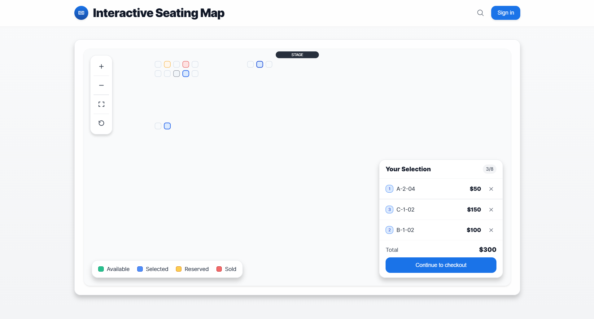

# Interactive Event Seating Map

A React + TypeScript application that renders an interactive seating map for events. Users can select up to 8 seats, view details, and navigate using both mouse and keyboard controls.



## Quick Start

```bash
pnpm install && pnpm dev
```

The application will be available at `http://localhost:5173`

## Architecture Choices & Trade-offs

### Core Technologies
- **React 19 + TypeScript**: Provides type safety and modern React features
- **Vite**: Fast development server and build tool
- **Zustand + Immer**: Lightweight state management with immutable updates
- **SVG Rendering**: Chosen over Canvas for better accessibility and DOM integration
- **Tailwind CSS**: Utility-first styling for rapid development

### Performance Optimizations
- **Virtualization**: Uses `react-window` for sections with >1000 seats to maintain 60fps
- **Memoization**: Seat components are memoized to prevent unnecessary re-renders
- **Efficient State Updates**: Zustand with Immer ensures minimal re-renders
- **SVG Transforms**: Hardware-accelerated zoom/pan using CSS transforms

### Accessibility Features
- **Keyboard Navigation**: Arrow keys for panning, +/- for zoom, Tab for seat focus
- **ARIA Labels**: Comprehensive labeling for screen readers
- **Focus Management**: Visible focus indicators and logical tab order
- **Semantic HTML**: Proper roles and descriptions for assistive technology

### Mobile Support
- **Touch Gestures**: Single-finger pan and two-finger pinch-to-zoom
- **Responsive Design**: Adapts to mobile viewport sizes
- **Touch-friendly Controls**: Appropriately sized interactive elements

### Data Architecture
- **JSON-based**: Venue data loaded from `/public/venue.json`
- **Type-safe**: Full TypeScript interfaces for all data structures
- **Persistence**: Selected seats saved to localStorage and restored on reload

### Trade-offs Made

1. **SVG vs Canvas**: Chose SVG for accessibility and easier DOM manipulation, though Canvas might be faster for extremely large datasets (>50k seats)

2. **Client-side Rendering**: All rendering happens client-side for simplicity, though server-side rendering could improve initial load times

3. **Memory vs Performance**: Keeps all seat data in memory for fast access, which may not scale to venues with 100k+ seats

4. **Bundle Size**: Included multiple libraries (Konva, D3, Framer Motion) for potential future features, increasing bundle size

## Features Implemented

✅ **Core Requirements**
- Load venue data from `public/venue.json`
- Render seats in correct positions
- Smooth performance with large seat counts
- Mouse and keyboard seat selection
- Seat details display
- Up to 8 seat selection limit
- Selection persistence via localStorage
- Full accessibility support
- Desktop and mobile compatibility

✅ **Additional Features**
- Zoom and pan controls
- Visual selection summary with pricing
- Touch gesture support for mobile
- Keyboard shortcuts for navigation
- Loading states and error handling

## Project Structure

```
src/
├── components/
│   ├── Header/           # App header component
│   ├── Navigation/       # Zoom controls
│   └── SeatingMap/       # Main seating map components
│       ├── index.tsx     # Main seating map container
│       ├── Seat.tsx      # Individual seat component
│       └── VirtualizedSeats.tsx # Performance optimization
├── hooks/
│   ├── useKeyboardNavigation.ts # Keyboard controls
│   ├── useSeatingMap.ts  # Seating logic
│   └── useZoom.ts        # Zoom/pan functionality
├── store/
│   └── seatingStore.ts   # Global state management
├── types/
│   └── venue.ts          # TypeScript interfaces
└── data/
    └── mockVenue.ts      # Fallback data (not used)
```

## Testing

To run tests (when implemented):
```bash
pnpm test
```

## Build

To build for production:
```bash
pnpm build
```

## Browser Support

- Chrome/Edge 88+
- Firefox 85+
- Safari 14+
- Mobile browsers with touch support

## Known Limitations

- No real-time seat updates (WebSocket integration would be needed)
- Limited to venues that fit reasonably in browser memory
- No server-side seat locking mechanism
- Heat map visualization not implemented

## Future Enhancements

- WebSocket integration for live seat updates
- Heat map toggle for price visualization
- "Find N adjacent seats" helper
- Dark mode support
- End-to-end testing with Playwright
- Server-side rendering for better SEO
